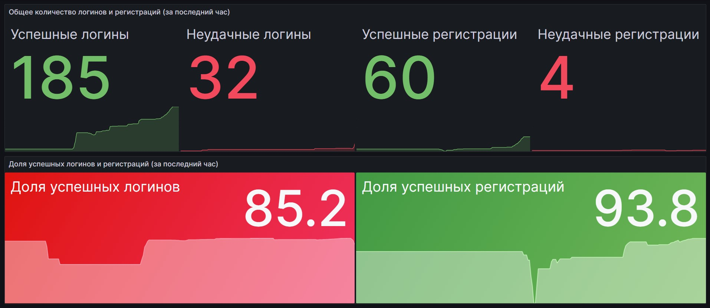
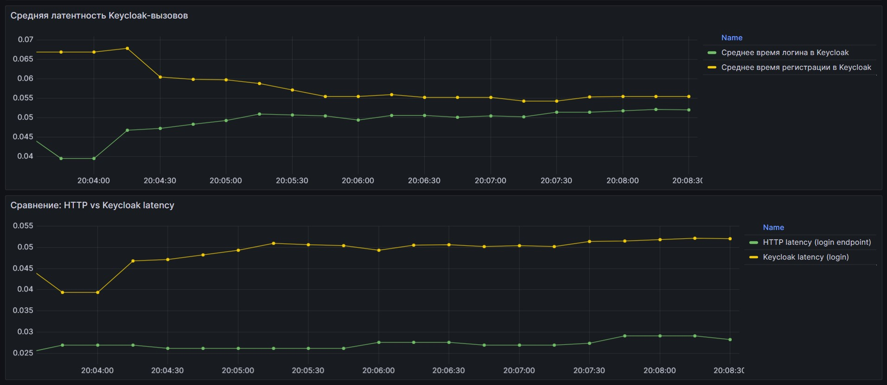
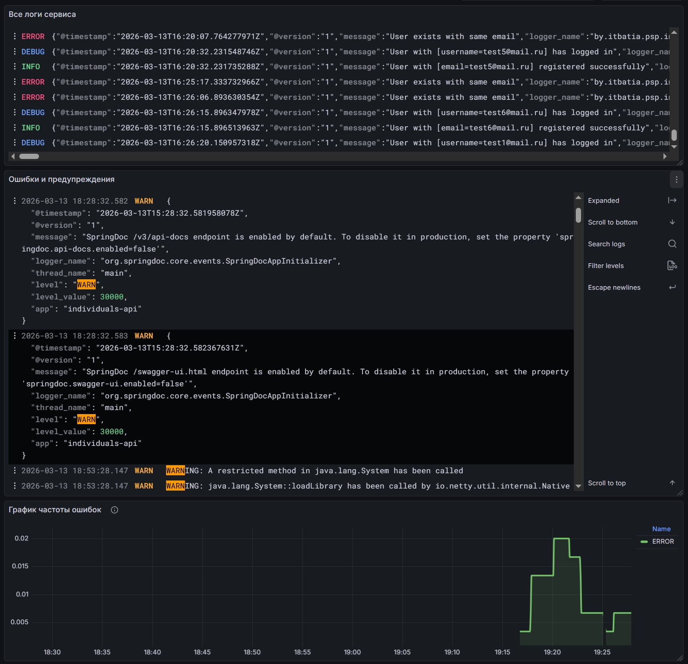

# Payment System

### Структура

- `individuals-api` — оркестратор аутентификации

### Сборка

`./gradlew clean :individuals-api:bootJar`

### Запуск

`docker-compose up -d`

### Gradle commands

✅ Удалить папки `build/` во всех модулях:  
`./gradlew clean`

✅ Собрать JAR для указанного модуля (individuals-api):  
`/gradlew :individuals-api:bootJar`

✅ Полная пересборка модуля (очистка + сборка):  
`./gradlew clean :individuals-api:bootJar`

✅ Пересобрать Java-код на основе OpenAPI-спецификации (блок openApiGenerate):  
`./gradlew clean :individuals-api:openApiGenerate`

# Individuals-API

## Metrics and Observability

Сервис `individuals-api` реализует полноценную систему мониторинга на основе `Spring Boot Actuator` + `Micrometer` +
`Prometheus` + `Grafana`, что позволяет оперативно отслеживать:

- Состояние сервиса (HTTP-запросы, ошибки, задержки),
- Бизнес-метрики (логины, регистрации, успех/неудача),
- Время выполнения критических операций (вызов Keycloak).

🔧 **Архитектура**

| Компонент                        | Роль                                                    |
|:---------------------------------|:--------------------------------------------------------|
| `micrometer-registry-prometheus` | Экспорт метрик в формате временных рядов `Prometheus`   |
| `/actuator/prometheus`           | Эндпоинт для сбора метрик (включён в `application.yml`) | 
| `Prometheus` (Docker)            | Сбор и хранение метрик с интервалом 15 секунд           | 
| `Grafana` (Docker)               | Визуализация через дашборд `individuals-api-dashboard`  | 

📈 **Ключевые метрики**

1. Бизнес-метрики (кастомные, регистрируются в коде)

- `login_total{status="success"}` — успешные входы
- `login_total{status="fail"}` — неудачные входы
- `registration_total{status="success"}` — успешные регистрации
- `registration_total{status="fail"}` — неудачные регистрации
- `kc_login_latency_seconds_*` — латентность вызова Keycloak при логине
- `kc_registration_latency_seconds_*` — латентность вызова Keycloak при регистрации*

> *Реализовано через `MeterRegistry` и `Timer.Sample`, чтобы измерять точное время взаимодействия с `Keycloak`,
> а не весь HTTP-запрос.

2. Системные метрики (автоматически от `Spring Boot`)

- `http_server_requests_seconds_count{uri="/api/v1/auth/login", status="401"}` — количество ошибок аутентификации
- `http_server_requests_seconds_sum` / `_count` — среднее время обработки запросов

🛠 **Как это работает в коде**

```java
// Пример: измерение времени логина
@Override
public Mono<TokenResponse> login(String username, String password) {
    Timer.Sample sample = metricsService.startTimer();
    return keycloakClient.requestToken(username, password)
        .doOnSuccess(_ -> {
            metricsService.incrementSuccessfulLogin();
            metricsService.stopTimerOnSuccess(sample, Meter.KC_LOGIN_LATENCY);
        })
        .doOnError(_ -> {
            metricsService.incrementFailedLogin();
            metricsService.stopTimerOnError(sample, Meter.KC_LOGIN_LATENCY);
        });
}
```

Метрики регистрируются в `MetricsConfig` и используются в `MetricsService` для централизованного управления.

📊 **Дашборд в Grafana**

Дашборд [individuals-api](grafana/dashboards/individuals-api-dashboard.json) автоматически загружается при старте
контейнера `Grafana` (через `provisioning/dashboards/`). Он включает **4 ключевые панели**:

1. Общее количество логинов и регистраций (за последний час)  
   → Показывает абсолютное число событий (`increase(...)`) с цветовой индикацией:  
   ✅ Успешные — зелёный  
   ❌ Неудачные — красный

2. Доля успешных логинов и регистраций  
   → Вычисляется, как `успех / всего * 100%`, с порогами:  
   < 90% → 🔴 красный  
   ≥ 90% → 🟢 зелёный

3. Средняя латентность Keycloak-вызовов  
   → Сравнение `kc_login_latency` и `kc_registration_latency` (в секундах)  
   → Использует `rate(sum)/rate(count)` с защитой от деления на ноль.

4. Сравнение: HTTP vs Keycloak latency  
   → Показывает, сколько времени тратится на сам сервис (`http_server_requests`) и сколько — на вызов Keycloak (
   `kc_*_latency`).  
   → Помогает выявить узкие места (например, если Keycloak медленный, а HTTP-обработка быстрая).

> 💡 Все панели используют фиксированный `UID` источника данных (`PROMETHEUS_DS`), поэтому дашборд корректно
> импортируется в любую `Grafana` с такой же `provisioning`-конфигурацией.

🖼 **Примеры визуализации**

| Панель № |                      Скриншот                      |
|:--------:|:--------------------------------------------------:|
|  1 и 2   |  |
|  3 и 4   |  |

## Дашборд логов

Для централизованного анализа логов в Grafana создан отдельный дашборд, который позволяет в реальном времени
отслеживать поведение сервиса, выявлять ошибки и коррелировать их с метриками.

**📊 Панель 1: Все логи сервиса**

- Тип: Logs
- Запрос: `{app="individuals-api"}`
- Описание: Отображает все логи сервиса `individuals-api` в режиме реального времени. Полезно для общего мониторинга
  и отладки последовательности событий (например, вызов → обработка → ответ).

**📊 Панель 2: Ошибки и предупреждения**

- Тип: Logs
- Запрос: `{app="individuals-api"} |~ "(ERROR|WARN)"`
- Описание: Фильтрует только критические и предупреждающие сообщения. Позволяет быстро находить проблемы без шума
  от информационных логов.

**📊 Панель 3: График частоты ошибок**

- Тип: Time series
- Запрос: `rate({app="individuals-api"} |= "ERROR" [5m])`
- Описание: Показывает динамику количества ошибок во времени (ошибок в минуту). Эту панель можно использовать для
  корреляции со всплесками в метриках (например, рост 5xx-ответов в Prometheus).

Скриншот с примером:


## Developers FYI

📝 **Документация**:

✅ [Docker driver client](https://grafana.com/docs/loki/latest/send-data/docker-driver)  
✅ [Promtail > Справочник по конфигурации](https://grafana.com/docs/loki/latest/send-data/promtail/configuration)  
✅ [Лог-драйвер Loki > конфигурация](https://grafana.com/docs/loki/latest/send-data/docker-driver/configuration/#configure-the-logging-driver-for-a-swarm-service-or-compose)

📌 **loki docker driver**:

Начиная с Docker v20.10, появилась поддержка `custom logging drivers` через plugins.  
Если версия Docker ≥ 20.10, надо установить plugin:

```terminaloutput
docker plugin install grafana/loki-docker-driver:latest --alias loki --grant-all-permissions
```

Эта команда устанавливает Loki-драйвер как официальный плагин Docker.  
После этого можно использовать driver: `loki`. Для этого в `docker-compose.yml` для сервиса `individuals-api`
необходимо добавить:

```yaml
logging:
  driver: loki                                      # указывает Docker использовать Loki-драйвер для отправки логов
  options:
    loki-url: "http://loki:3100/loki/api/v1/push"   # endpoint Loki API для приёма логов
    loki-external-labels: "app=individuals-api,project=payment-system"
    loki-batch-size: "10240"                        # 10 KB вместо 1 MB
    loki-batch-wait: "1s"                           # Ждать максимум 1 секунду
```

⚠️ _информация о лог-драйвере Loki представлена в ознакомительных целях и актуальна только для Unix-подобных ОС._

> ❗ Loki-драйвер - это альтернативный вариант использованию отдельного агента `Promtail`

## Project platform

💻 **Для запуска проекта не на Windows необходимо**:

1) добавить том в `docker-compose.yml` -> service `promtail` (см. таблицу);
2) изменить host в `promtail/promtail-config.yml` (см. таблицу).

| Платформа                | Том в `docker-compose.yml`                  | host в `promtail-config.yml`    |
|:-------------------------|:--------------------------------------------|:--------------------------------|
| Linux                    | - /var/run/docker.sock:/var/run/docker.sock | unix:///var/run/docker.sock     |
| macOS (Docker Desktop)   | - /var/run/docker.sock:/var/run/docker.sock | unix:///var/run/docker.sock     |
| Windows (Docker Desktop) | ❌ не нужен том                              | tcp://host.docker.internal:2375 |

ℹ️ Детали и описание:

1. Linux:

- Docker Engine работает напрямую на хосте;
- Сокет `/var/run/docker.sock` — это Unix domain socket;
- `Promtail` (внутри контейнера) может к нему обратиться, если смонтирован том.

2. macOS (Docker Desktop):

- Docker Desktop на macOS запускает виртуальную машину (VM) на базе HyperKit;
- Но Docker Desktop проксирует Unix-сокет `/var/run/docker.sock` на хост macOS;
- Файл `/var/run/docker.sock` существует на macOS, и он перенаправляет запросы в VM;
- `Promtail` (внутри контейнера) может к нему обратиться, если смонтирован том.

3. Windows (Docker Desktop)

- Docker Desktop на Windows не предоставляет Unix-сокет `/var/run/docker.sock`.
- Зато он предоставляет специальный DNS-адрес: `host.docker.internal`, который разрешается в IP хоста.

> 💡 Убедитесь, что в Docker Desktop включены опции:  
> Settings → General → ☑ Expose daemon on tcp://localhost:2375 without TLS  
> Settings → General → Use the WSL 2 based engine.