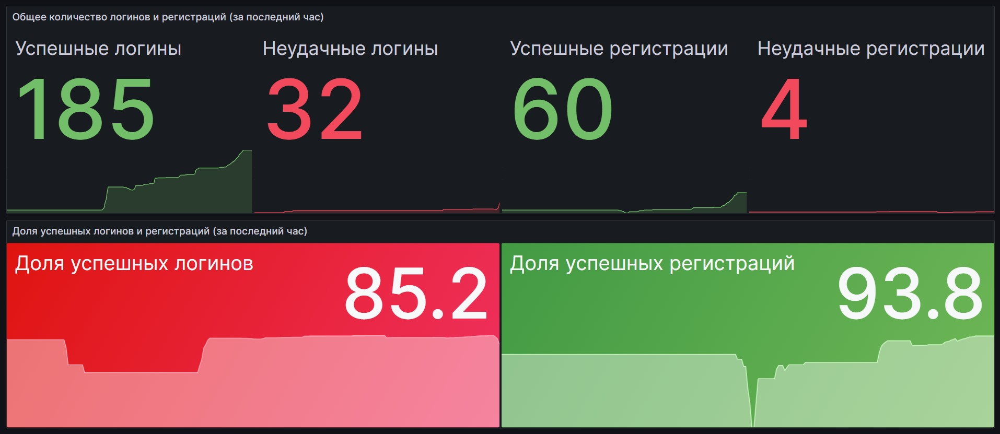
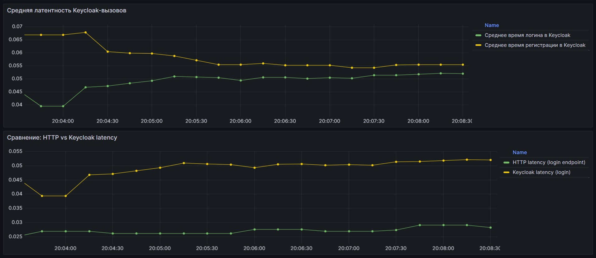
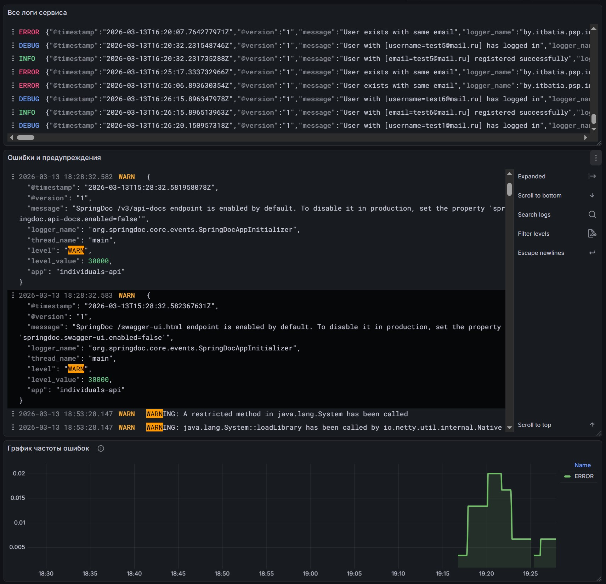

# Payment System

### Структура

- `individuals-api` — оркестратор аутентификации

## ▶️ Запуск

1. **Клонируйте репозиторий**

```
https://github.com/itbatia/payment-system
```

2. **Соберите сервис**

```
./gradlew clean :individuals-api:build
```

3. **Запустите всё окружение**

⚠️ _Важно! Предварительно изучите раздел про_ [_кроссплатформенность_](#Кроссплатформенность)

```
docker-compose up -d
```

Система поднимет следующие компоненты:

- `individuals-api` — Spring Boot сервис
- `keycloak` — сервер аутентификации с предзагруженной конфигурацией (realm-config.json)
- `postgres` — база данных для Keycloak
- `prometheus` — сбор метрик
- `loki` + `promtail` — сбор и агрегация логов
- `grafana` — визуализация метрик и логов

Задействованные порты:

- `8082` — individuals-api
- `8080` — keycloak
- `5433` — postgres
- `9090` — prometheus
- `3100` — loki
- `3000` — grafana

> 💡 _освободите их перед запуском при необходимости_

4. **Проверьте статус контейнеров**

```
docker-compose ps
```

_Все сервисы должны быть в состоянии Up.  
Первый запуск может занять несколько минут (скачать images, инициализация Keycloak и импорт realm и т.д.)_

# Individuals-api

🌐 **Доступные эндпоинты**

| Компонент  | URL                                         | Описание                         |
|:-----------|:--------------------------------------------|:---------------------------------|
| Swagger UI | http://localhost:8082/swagger-ui/index.html | Интерактивная документация API   |
| Grafana    | http://localhost:3000                       | Логин: `admin` / Пароль: `admin` |
| Keycloak   | http://localhost:8080                       | Логин: `admin` / Пароль: `admin` |

## 🧪 Тестирование

**Postman коллекция**

Для быстрой демонстрации работы API используйте Postman-коллекцию:

📁 `infrastructure/postman/Payment-system.postman_collection.json`
[link](/infrastructure/postman/Payment-system.postman_collection.json)  
📁 `infrastructure/postman/README.md`
[link](/infrastructure/postman/README.md)

> Импортируйте её в Postman → запускайте REST-запросы.  
> Сценарии для тестирования описаны в README.md.

**Автоматические тесты**

Проект включает:

- Юнит-тесты (через `JUnit 5` + `Mockito`)
- Интеграционные тесты (через `Testcontainers` + `KeycloakContainer`)

Запустить все тесты:

```
./gradlew test
```

## 💻Кроссплатформенность

Проект корректно работает на Linux, macOS и Windows (Docker Desktop). Однако способ сбора логов отличается.  
Конфигурация Promtail по платформе:

| Платформа                | Том в `docker-compose.yml`                  | host в `promtail-config.yml`    |
|:-------------------------|:--------------------------------------------|:--------------------------------|
| Linux                    | - /var/run/docker.sock:/var/run/docker.sock | unix:///var/run/docker.sock     |
| macOS (Docker Desktop)   | - /var/run/docker.sock:/var/run/docker.sock | unix:///var/run/docker.sock     |
| Windows (Docker Desktop) | ❌ не нужен том                              | tcp://host.docker.internal:2375 |

> ⚠️ Сейчас конфигурация `Promtail` адаптирована под Windows. Для запуска проекта на Linux или macOS:
> 1) добавить том в `docker-compose.yml` -> service `promtail`;
> 2) изменить host в `promtail/promtail-config.yml`.

ℹ️ Детали и описание:

1. Linux:

- Docker Engine работает напрямую на хосте;
- Сокет `/var/run/docker.sock` — это Unix domain socket;
- `Promtail` (внутри контейнера) может к нему обратиться, если смонтирован том.

2. macOS (Docker Desktop):

- Docker Desktop на macOS запускает виртуальную машину (VM) на базе HyperKit;
- Но Docker Desktop проксирует Unix-сокет `/var/run/docker.sock` на хост macOS;
- Файл `/var/run/docker.sock` существует на macOS, и он перенаправляет запросы в VM;
- `Promtail` (внутри контейнера) может к нему обратиться, если смонтирован том.

3. Windows (Docker Desktop)

- Docker Desktop на Windows не предоставляет Unix-сокет `/var/run/docker.sock`.
- Зато он предоставляет специальный DNS-адрес: `host.docker.internal`, который разрешается в IP хоста.

> 💡 Убедитесь, что в Docker Desktop включены опции:  
> Settings → General → ☑ Expose daemon on tcp://localhost:2375 without TLS  
> Settings → General → Use the WSL 2 based engine.

## 📂 Структура проекта

```
/payment-system  
├── infrastructure/                       # Инфраструктурные конфигурации для observability, CI/CD и артефактов
│   ├── alertmanager/                     # Правила оповещений и шаблоны уведомлений для Alertmanager
│   ├── alloy/                            # Конфигурация Alloy — unified collector для метрик, логов и трассировок
│   ├── grafana/                          # Provisioning: дашборды, источники данных (Prometheus, Tempo, Loki), настройки пользователей
│   ├── loki/                             # Конфигурация Loki — система агрегации и хранения логов
│   ├── nexus/                            # Настройка и автоматизация Nexus Repository Manager
│   │   ├── scripts/
│   │   │   └── nexus_init.sh             # Инициализационный скрипт: настройка пользователя, EULA, репозиториев
│   │   └── schemas/
│   │       ├── confluent_proxy.json      # Конфигурация proxy-репозитория к packages.confluent.io
│   │       ├── maven_public_group.json   # Групповой репозиторий, объединяющий maven-central, confluent-proxy и внутренние релизы
│   │       └── maven_releases.json       # Hosted-репозиторий для публикации собственных артефактов (с ALLOW_ONCE)
│   ├── postman/                          # Postman-коллекции и окружения для демонстрации API и интеграционного тестирования
│   ├── prometheus/                       # Конфигурация scrape targets, recording/alerting rules для Prometheus
│   ├── readme-sources/                   # Исходники для README.md: диаграммы C4, sequence-диаграммы, скриншоты Grafana
│   ├── tempo/                            # Конфигурация Tempo — backend для хранения и поиска распределённых трассировок (traces)
│   └── developer/                        # Технические заметки разработчика: решения проблем, ссылки, чек-листы развёртывания
│
├── individuals-api/                      # Микросервис-оркестратор: внешний API, взаимодействие с Keycloak и person-service
│   ├── openapi/                          # OpenAPI-спецификация внешнего REST API (YAML)
│   ├── resources/                        # Статические ресурсы: realm-config.json для импорта в Keycloak при старте
│   ├── src/main/java/                    # Код: контроллеры, сервисы, Feign-клиенты, мапперы, конфигурация WebClient
│   ├── build.gradle.kts                  # Зависимости, настройка OpenAPI Generator, публикация образа
│   └── Dockerfile                        # Multi-stage сборка Docker-образа на основе Eclipse Temurin
│
├── person-service/                       # Внутренний микросервис: управление пользователями, адресами, индивидуальными данными
│   ├── openapi/                          # OpenAPI-спецификация внутреннего REST API (YAML) — используется для генерации клиента
│   ├── src/main/java/                    # Код: JPA-сущности, репозитории, сервисы с транзакциями, Envers-аудит, контроллеры
│   ├── build.gradle.kts                  # Зависимости, настройка OpenAPI Generator, задача публикации клиента в Nexus
│   └── Dockerfile                        # Multi-stage сборка Docker-образа на основе Eclipse Temurin
│
├── common/                               # Общий модуль: содержит только DTO, сгенерированные из OpenAPI-схем (без бизнес-логики)
│
├── docker-compose.yml                    # Основной файл оркестрации: поднимает все сервисы (individuals-api, person-service, PostgreSQL, observability stack, Nexus и др.)
├── gradle.properties                     # Централизованное управление версиями зависимостей и плагинов (springBootVersion, openapiGeneratorVersion и др.)
├── settings.gradle.kts                   # Объявление модулей, pluginManagement, dependencyResolutionManagement (включая Nexus как репозиторий)
└── README.md                             # Документация: архитектура, схемы, инструкции по запуску, тестированию и развёртыванию
```

## Observability-стек

```text
Payment-service APIs
│
├── OTLP (трассировки + метрики) ──┐
│                                  │
└── stdout (Docker logs) ──────────┤
                                   ↓
                              Alloy (collector)
                                   │
           ┌───────────────────────┼───────────────────────┐
           ↓                       ↓                       ↓
        Tempo                    Loki                   Prometheus
   (traces / spans)        (structured logs)     (metrics via remote_write)
           │                       │                       │
           └───────────────────────┼───────────────────────┘
                                   ↓
                                Grafana
                         (Dashboards + Alerting)
                                   │
                                   ↓
                              Alertmanager
                                   │
                  ┌────────────────┴────────────────┐
                  ↓                                 ↓
              Telegram                    Grafana (alerting/list)
```

# Individuals-API

Микросервис, отвечающий за оркестрацию процессов аутентификации пользователей в системе.  
Построен на современном реактивном веб-фреймворке `Spring WebFlux`.


## Swagger

📚 **Документация API**

Проект сопровождается полной спецификацией OpenAPI 3.0, которая:

- Описывает все эндпоинты, методы, параметры и тела запросов/ответов
- Включает примеры успешных и ошибочных сценариев
- Автоматически генерирует интерактивную документацию через Swagger UI

**Как посмотреть документацию**

Откройте в браузере на запущенном приложении

- Swagger UI: http://localhost:8082/swagger-ui/index.html
- OpenAPI JSON: http://localhost:8082/v3/api-docs

> 💡 Используйте `Local server` для тестирования API и выполнения запросов.

## Metrics and Observability

Сервис `individuals-api` реализует полноценную систему мониторинга на основе `Spring Boot Actuator` + `Micrometer` +
`Prometheus` + `Grafana`, что позволяет оперативно отслеживать:

- Состояние сервиса (HTTP-запросы, ошибки, задержки),
- Бизнес-метрики (логины, регистрации, успех/неудача),
- Время выполнения критических операций (вызов Keycloak).

🔧 **Архитектура**

| Компонент                        | Роль                                                    |
|:---------------------------------|:--------------------------------------------------------|
| `micrometer-registry-prometheus` | Экспорт метрик в формате временных рядов `Prometheus`   |
| `/actuator/prometheus`           | Эндпоинт для сбора метрик (включён в `application.yml`) | 
| `Prometheus` (Docker)            | Сбор и хранение метрик с интервалом 15 секунд           | 
| `Grafana` (Docker)               | Визуализация через дашборд `individuals-api-dashboard`  | 

📈 **Ключевые метрики**

1. Бизнес-метрики (кастомные, регистрируются в коде)

- `login_total{status="success"}` — успешные входы
- `login_total{status="fail"}` — неудачные входы
- `registration_total{status="success"}` — успешные регистрации
- `registration_total{status="fail"}` — неудачные регистрации
- `kc_login_latency_seconds_*` — латентность вызова Keycloak при логине
- `kc_registration_latency_seconds_*` — латентность вызова Keycloak при регистрации*

> *Реализовано через `MeterRegistry` и `Timer.Sample`, чтобы измерять точное время взаимодействия с `Keycloak`,
> а не весь HTTP-запрос.

2. Системные метрики (автоматически от `Spring Boot`)

- `http_server_requests_seconds_count{uri="/api/v1/auth/login", status="401"}` — количество ошибок аутентификации
- `http_server_requests_seconds_sum` / `_count` — среднее время обработки запросов

🛠 **Как это работает в коде**

```java
// Пример: измерение времени логина
@Override
public Mono<TokenResponse> login(String username, String password) {
    Timer.Sample sample = metricsService.startTimer();
    return keycloakClient.requestToken(username, password)
        .doOnSuccess(_ -> {
            metricsService.incrementSuccessfulLogin();
            metricsService.stopTimerOnSuccess(sample, Meter.KC_LOGIN_LATENCY);
        })
        .doOnError(_ -> {
            metricsService.incrementFailedLogin();
            metricsService.stopTimerOnError(sample, Meter.KC_LOGIN_LATENCY);
        });
}
```

Метрики регистрируются в `MetricsConfig` и используются в `MetricsService` для централизованного управления.

📊 **Дашборд в Grafana**

Дашборд [individuals-api](infrastructure/grafana/dashboards/individuals-api-dashboard.json) автоматически загружается при старте
контейнера `Grafana` (через `infrastructure/provisioning/dashboards/`). Он включает **4 ключевые панели**:

1. Общее количество логинов и регистраций (за последний час)  
   → Показывает абсолютное число событий (`increase(...)`) с цветовой индикацией:  
   ✅ Успешные — зелёный  
   ❌ Неудачные — красный

2. Доля успешных логинов и регистраций  
   → Вычисляется, как `успех / всего * 100%`, с порогами:  
   < 90% → 🔴 красный  
   ≥ 90% → 🟢 зелёный

3. Средняя латентность Keycloak-вызовов  
   → Сравнение `kc_login_latency` и `kc_registration_latency` (в секундах)  
   → Использует `rate(sum)/rate(count)` с защитой от деления на ноль.

4. Сравнение: HTTP vs Keycloak latency  
   → Показывает, сколько времени тратится на сам сервис (`http_server_requests`) и сколько — на вызов Keycloak (
   `kc_*_latency`).  
   → Помогает выявить узкие места (например, если Keycloak медленный, а HTTP-обработка быстрая).

> 💡 Все панели используют фиксированный `UID` источника данных (`PROMETHEUS_DS`), поэтому дашборд корректно
> импортируется в любую `Grafana` с такой же `provisioning`-конфигурацией.

🖼 **Примеры визуализации**

| Панель № |                      Скриншот                      |
|:--------:|:--------------------------------------------------:|
|  1 и 2   |  |
|  3 и 4   |  |

## Дашборд логов

Для централизованного анализа логов в Grafana создан отдельный дашборд, который позволяет в реальном времени
отслеживать поведение сервиса, выявлять ошибки и коррелировать их с метриками.

**📊 Панель 1: Все логи сервиса**

- Тип: Logs
- Запрос: `{app="individuals-api"}`
- Описание: Отображает все логи сервиса `individuals-api` в режиме реального времени. Полезно для общего мониторинга
  и отладки последовательности событий (например, вызов → обработка → ответ).

**📊 Панель 2: Ошибки и предупреждения**

- Тип: Logs
- Запрос: `{app="individuals-api"} |~ "(ERROR|WARN)"`
- Описание: Фильтрует только критические и предупреждающие сообщения. Позволяет быстро находить проблемы без шума
  от информационных логов.

**📊 Панель 3: График частоты ошибок**

- Тип: Time series
- Запрос: `rate({app="individuals-api"} |= "ERROR" [5m])`
- Описание: Показывает динамику количества ошибок во времени (ошибок в минуту). Эту панель можно использовать для
  корреляции со всплесками в метриках (например, рост 5xx-ответов в Prometheus).

Скриншот с примером:


## Developers FYI

📝 **Документация**:

✅ [Docker driver client](https://grafana.com/docs/loki/latest/send-data/docker-driver)  
✅ [Promtail > Справочник по конфигурации](https://grafana.com/docs/loki/latest/send-data/promtail/configuration)  
✅ [Лог-драйвер Loki > конфигурация](https://grafana.com/docs/loki/latest/send-data/docker-driver/configuration/#configure-the-logging-driver-for-a-swarm-service-or-compose)

> 💡 use VPN to access.

📌 **loki docker driver**:

Начиная с Docker v20.10, появилась поддержка `custom logging drivers` через plugins.  
Если версия Docker ≥ 20.10, надо установить plugin:

```terminaloutput
docker plugin install grafana/loki-docker-driver:latest --alias loki --grant-all-permissions
```

Эта команда устанавливает Loki-драйвер как официальный плагин Docker.  
После этого можно использовать driver: `loki`. Для этого в `docker-compose.yml` для сервиса `individuals-api`
необходимо добавить:

```yaml
logging:
  driver: loki                                      # указывает Docker использовать Loki-драйвер для отправки логов
  options:
    loki-url: "http://loki:3100/loki/api/v1/push"   # endpoint Loki API для приёма логов
    loki-external-labels: "app=individuals-api,project=payment-system"
    loki-batch-size: "10240"                        # 10 KB вместо 1 MB
    loki-batch-wait: "1s"                           # Ждать максимум 1 секунду
```

⚠️ _информация о лог-драйвере Loki представлена в ознакомительных целях и актуальна только для Unix-подобных ОС._

> ❗ Loki-драйвер - это альтернативный вариант использованию отдельного агента `Promtail`

# Person-service

## 🧪 Тестирование

1. **READ (GET)**
    - Успешное создание → 201
    - Создание с дублирующим email → 409
    - Создание с невалидным email → 400
    - Создание с несуществующим country ID → 404
2. **READ (GET)**
    - Получение по ID → 200
    - Получение по несуществующему ID → 404
    - Получение по email → 200
    - Получение по несуществующему email → 404
3. **UPDATE**
    - Обновление данных (имя, фамилия, телефон) → 200 + проверка изменений
    - Обновление с дублирующим email → 409
    - Обновление несуществующего ID → 404
    - Частичное обновление (только адрес или только паспорт)
4. **DELETE**
    - Удаление существующего → 204  
      Проверка: после удаления:
       - status = DELETED
       - address.archivedAt != null
    - Удаление несуществующего → 404
    - Повторное удаление → 400 (BadRequestApiException)  

## 🔧 Gradle commands

✅ Удалить папки `build/` во всех модулях:  
`./gradlew clean`

✅ Полный цикл сборки (компилляция, тесты, сборка jar/sourcesJar):  
`./gradlew :individuals-api:build`
`./gradlew clean :individuals-api:build :person-service:build`

✅ Собрать (без тестов) JAR для указанного модуля (individuals-api):  
`/gradlew :individuals-api:bootJar`

✅ Полная пересборка модуля (очистка + сборка):  
`./gradlew clean :individuals-api:bootJar`
`./gradlew clean :individuals-api:bootJar :person-service:bootJar`

✅ Пересобрать Java-код на основе OpenAPI-спецификации (блок openApiGenerate):  
`./gradlew :individuals-api:clean :individuals-api:openApiGenerate`  
`./gradlew :person-service:clean :person-service:openApiGenerateAll`
`./gradlew clean :individuals-api:openApiGenerate :person-service:openApiGenerateAll`

✅ Выведет полное дерево зависимостей с указанием фактических версий, выбранных Spring Boot BOM:  
`./gradlew :person-service:dependencies --configuration runtimeClasspath`

✅ Отправить артефакт в Nexus:  
`./gradlew :common:publish`

✅ Очистить кэш Gradle:  
`./gradlew --refresh-dependencies`

🔧 **Docker commands**

✅ Запустить все сервисы проекта в фоновом режиме:  
`docker-compose up -d`

✅ Запустить все сервисы проекта в фоновом режиме с пересборкой image:  
`docker-compose up -d --build`

✅ Перезапустить сервис:  
`docker compose restart service-name`  

✅ Остановить и удалить контейнеры и сети:  
`docker-compose down`

✅ Остановить и удалить контейнеры, сети и volume:  
`docker-compose down -v`

✅ Посмотреть список и текущее состояние (статус) контейнеров:  
`docker-compose ps`

🔧 **Useful links**

[spring-boot-dependencies-4.0.5.pom](https://repo1.maven.org/maven2/org/springframework/boot/spring-boot-dependencies/4.0.5/spring-boot-dependencies-4.0.5.pom)
